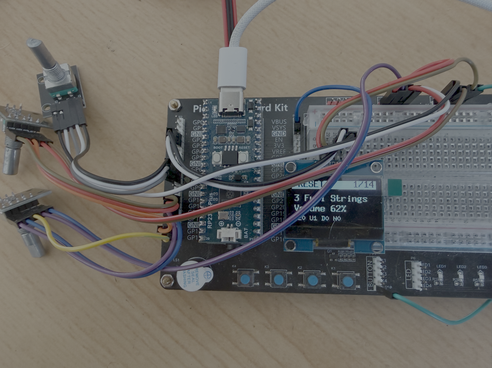

# PicoFaceSM — ARP Solina String Ensemble

<p align="center">
  
</p>


An emulation of the ARP Solina String Ensemble on the same hardware and
software base as [PicoFaceRD](https://github.com/Michi71/PicoFaceRD),
[PicoFaceCP](https://github.com/Michi71/PicoFaceCP),
[PicoFaceDX](https://github.com/Michi71/PicoFaceDX) and
[PicoFaceYC](https://github.com/Michi71/PicoFaceYC).

**Status:** running firmware for the RP2350, plus a macOS host test that
compiles the identical engine sources.

The sound engine follows the original schematic
(`doc/StringEnsemble_Schematics-0275.pdf`, page 4, sheet 015.0212) and the
signal flow diagram (`doc/ARP Solina Schematics.pdf`, sheet 015.0214):

```
Master Oscillator (SAA1004) + Tuning
  → Divider Circuit: 9× SAJ110 dividers → Sawtooth Circuits
  → Gate Circuit: 10× TDA470 (4' and 8' per key) + Sustain Circuits
     → Gate Output Circuit  → VIOLA (8')   / VIOLIN (4')
     → Formant Circuit TR5  → TRUMPET (8') / HORN (4')
  → Bass Circuit: Low-Tone Selection → Clipper → Bass Sustain
     → CELLO (8') / CONTRA BASS (16') → Low-Pass
  → Register Circuit → VCA → Low-Pass
  → Modulator Circuit I/II/III (each an ORB 33 BBD + two-stage low-pass)
  → Output Amplifier → Correction Filter → Out

Control Circuit: a fast tremolo oscillator and a slow chorus oscillator, each
routed through a low-pass, phase shifter and inverter to C1/C2/C3.
```

The essential point: the Solina is **not a polyphonic synthesiser**, it is an
organ with frequency dividers. Every note comes from a single master
oscillator and is locked in phase; there is no detuning between voices. The
six registers are filter taps, not waveforms. All the movement in the sound
comes from the ensemble.

## Where the code comes from

The engine follows the schematic structurally. The DSP models for the
ensemble, the filters and the waveshaper are adapted from
[string-machine](https://github.com/jpcima/string-machine) by Jean-Pierre
Cimalando (Boost Software License 1.0), which in turn builds on a model by
Peter Whiting. Each file header under `include/solina/` and `src/solina/`
names its specific source.

| File | Original circuit | Contents |
|---|---|---|
| `solina_divider.h` | Master Oscillator + Divider Circuit | 12 phase accumulators, octaves by shifting — bit-exact phase lock |
| `solina_keyboard.{h,cpp}` | Manual + Gate Circuit + Sustain Circuits | one gate per key, RC envelope, per-keyboard-group busses, bass with lowest-note priority |
| `solina_registers.{h,cpp}` | Gate Output + Formant + Bass Circuit | the six registers as filter taps |
| `solina_ensemble.{h,cpp}` | Control Circuit + Modulator I/II/III | dual LFO with three phases each, three delays of 5 ms ± 1 ms, output mix |
| `solina_phaser.{h,cpp}` | — (Behringer addition) | six all-pass stages per channel |
| `solina_dsp.h` | — | one-pole filters, biquad, soft clipper, polyBLEP (from string-machine) |
| `solina.{h,cpp}` | Register Circuit + Output Amplifier | parameters, programs, MIDI, output stage |

## Signal flow

```
 12 phase accumulators (master + dividers, phase-locked)
        │
        ├─ per held key: 8' and 4' sawtooth (polyBLEP) × gate envelope
        │        └─ summed onto 5 keyboard groups ──► timbre tracks the range
        │
        ├─ Gate Output Circuit  (LP → HP → high shelf → clipper)
        │     └─ Viola 8'  /  Violin 4'
        ├─ Formant Circuit      (LP)
        │     └─ Trumpet 8' /  Horn 4'
        └─ Bass Circuit         (lowest note, clipper, LP)
              └─ Cello 8'  /  Contrabass 16'
                     │
                     ▼
        Register Circuit → DC blocker
                     ▼
        Ensemble: 3 delays of 5 ms ± 1 ms, modulated by
                  tremolo LFO (3–9 Hz) + chorus LFO (0.3–0.9 Hz),
                  at 0°/120°/240° each
                  mid = (d1+d2+d3)·⅔     side = (d1−d3)·width
                     ▼
        Phaser (off by default) → Output Amplifier + Correction Filter → L/R
```

## Parameters

26 parameters, each `0.0 … 1.0`. The first eleven map exactly onto the front
panel (Behringer manual: *"Buttons Contrabass, cello, viola, violin, trumpet,
horn / Controls Volume bass, crescendo, sustain, volume, tune"*), followed by
the Control Circuit trimmers, the phaser and the filter tuning, which are
fixed component values in the original. See `enum SolinaParam` in
`include/solina/solina.h`.

The user interface spreads them over 14 pages: encoder 1 pages through,
pressing it returns to page 1, encoders 2 and 3 edit the two parameters of
the current page. The page table is a plain data structure at the top of
`src/SM_Controller.cpp` — reordering means moving a line.

Values move in steps of 1 % and snap to the percent grid on the first click.
The preset values do not sit on that grid (Volume in "Contrabass" is 0.827),
so without snapping the round values would never be reachable.

## Building the firmware (RP2350)

```bash
git submodule update --init --depth 1
cmake -S . -B build -G Ninja -DCMAKE_BUILD_TYPE=Release
cmake --build build
```

Result: `build/picofacesm.uf2`. Target platform `rp2350-arm-s`, board
`sparkfun_promicro_rp2350`, **444 MHz**. The scaffolding, hardware layer,
audio subsystem, USB MIDI and display are taken from
[PicoFaceRD](https://github.com/Michi71/PicoFaceRD).

| | |
|---|---|
| Flash | 87.8 kB (0.52 % of 16 MB) |
| RAM | 20.3 kB |
| of which sound engine | 27.5 kB code, 1.0 kB BSS |

Core 0 runs the audio producer in the main loop together with USB, MIDI, the
controls and the display; the DMA IRQ stays microscopic. Unlike PicoFaceRD
the Solina needs no voice worker on core 1 — core 1 is free.

Measured on the device (Waveshare Pico Audio, 44.1 kHz):

| | |
|---|---|
| peak load `P` while playing | 30–40 % |
| I2S underruns `U` | 0 |
| dropped IPC packets `D` | 0 |

44.1 kHz is therefore confirmed — neither a lower sample rate nor offloading
to core 1 is necessary.

### Build options

| Option | Default | |
|---|---|---|
| `SM_CLOCK_480` | `OFF` | 480 MHz instead of 444 MHz |
| `SM_DOUBLE_RESET` | `OFF` | double-tap RESET enters BOOTSEL |
| `SM_PHASER` | `ON` | compile the phaser |
| `SM_SAFE_MODE` | `OFF` | no veeprom, continuous test chord, UART progress marks |

### Why 444 MHz instead of 480 MHz

Measured, not guessed: on this board the firmware does not start reliably at
480 MHz, but is stable at 444 MHz. The comment in `pico_init()` already
records that 504 MHz would not boot on this chip — 480 MHz was the fallback
step and is evidently still too tight. There is plenty of compute headroom
(peak load 40 % at 480 MHz, so roughly 43 % at 444 MHz).

### Why double-tap RESET is disabled

`pico_bootsel_via_double_reset` is **not** linked in. With a Waveshare Pico
Audio board driving 3 W speakers, the inrush current on plug-in dips the
supply, the chip performs a brownout reset — and the library reads that as a
double tap and enters BOOTSEL mode instead of running the program. On the
RP2350 the flag lives in the POWMAN register `chip_reset.DOUBLE_TAP`, which
survives the dip, so shortening the detection window does not help. With
headphones instead of speakers it does not occur.

The BOOTSEL button keeps working regardless.

## Host test (macOS)

```bash
./test/build_solina.sh
./test/solina_test
```

Requires PortMidi (`brew install portmidi`). Opens a virtual MIDI input named
`solina` and plays through CoreAudio; the key bindings are documented at the
top of `test/solina_test.cpp`. This compiles the same `src/solina/` sources
as the firmware, with `-DSOLINA_HOST_BUILD` replacing the Pico audio
subsystem.

## Polyphony

The manual section (Viola, Violin, Trumpet, Horn) is **fully polyphonic
across all 49 keys** — there is no voice allocation at all; every key has its
own gate and its own envelope, exactly like the ten TDA470s in the original.
The bass section (Cello, Contrabass) is **monophonic with lowest-note
priority**, which is the Low-Tone Selection Circuit.

Releasing keys hold their slot until the envelope has decayed. When the list
is full, the most decayed releasing key is reused (its envelope is carried
over, so the level does not jump). If all 49 gates are genuinely held — by
keys or by the sustain pedal — a further key stays silent; the original has
only 49 gates too.

## Measurements (host, Apple M4)

| | |
|---|---|
| Tuning | A4 = 440.000 Hz, C4 = 261.626 Hz |
| Phase lock C2→C6 | < 5·10⁻⁷ (numerical precision) |
| Aliasing (sawtooth, register filters bypassed) | < −40 dB across the range |
| Ensemble delay at rest | 5.06 ms (target 5.00 ms + group delay of the anti-alias chain) |
| L/R correlation, ensemble (width 0.7) | 0.40 |
| Envelope swing, single held note | 4.9 dB (ensemble off: 1.9 dB) |
| Level of the eight programs | −19.6 to −11.2 dBFS; 20 keys at once −5.9 dBFS |
| All 49 keys, any program | ≤ 0.0 dBFS (soft limiter engages) |
| Register balance | all six within 0.8 dB |
| Compute | 10 keys: 284× real time, 0.35 % of one core |

## Deliberate deviations from the original

1. **The filters sit per keyboard group, not per note.** In the original the
   Gate Output Circuit has its own RC network per group (10K with 5n6 / 10n /
   22n / 47n …), which is a keyboard scaling of the timbre. string-machine
   filters per note. The per-group solution is faithful to the circuit and
   orders of magnitude cheaper.
2. **Corner frequencies are set relative to the group centre**, using the
   ratios from string-machine (which were tuned there by ear against the
   original). The transistor stages of the Formant Circuit cannot be traced
   reliably enough from the scan to derive transfer functions directly. All
   four values are adjustable via `Tone LP/HP/Shelf` and `Formant`.
3. **The register levels are balanced** (formant −14.4 dB, bass −8.4 dB
   against the strings). In the original the resistors at the register switch
   do this; without the balance the brass registers overload.
4. **Cubic instead of linear interpolation** in the delay lines
   (string-machine uses `de.fdelayltv(1, …)`). It makes no measurable
   difference to the modulation behaviour; it is simply the cleaner variant
   and costs almost nothing.
5. **Tremolo depth 0.10 instead of 0.3071.** The string-machine value produces
   about **19 cents** of pitch deviation at 5.83 Hz — an audible vibrato
   rather than a shimmer. At 0.10 it is about 6 cents, comparable to the slow
   row (5.7 cents at 0.58 Hz). Measured on a steady tone, RMS envelope:

   | Tremolo depth | Pitch deviation | Envelope slow (<2 Hz) | fast (>3 Hz) | Swing |
   |---|---|---|---|---|
   | 0.307 | 19.4 ct | 10 % | 76 % | 19.1 dB |
   | 0.120 |  7.6 ct | 20 % | 54 % | 13.5 dB |
   | 0.100 |  6.3 ct | — | — | — |
   | 0.000 |  0.0 ct | 24 % | 42 % | 10.8 dB |

   The remaining fast movement is the comb filter itself: with 5 ms base
   delay and ±1 ms modulation a partial passes through several notches per
   LFO half-cycle. The original does the same.
6. **Reconstruction filter from `doc/StringEnsemble_Schematics-0275.pdf`.**
   Modulator Circuit I has two cascaded active low-passes after the BBD
   (`ORB 33`) — stage 1 with 8n2/47p, stage 2 with 2n7/560p, 22K each.
   Treated as Sallen-Key (`f = 1/(2πR·√(C1C2))`, R = 22K) that gives roughly
   11.7 kHz and 5.9 kHz. The transistor stages cannot be traced completely,
   so these are estimates from the component values. Audibly they differ
   little from a single 2-pole at 5.75 kHz; they are simply the correct
   order. Adjustable via `Ens Tone`. **The default is 0.20** (7.7 / 3.9 kHz)
   rather than the schematic values at 0.50 — chosen by ear, because the high
   partials sweep through the comb notches fastest and contribute most to the
   restlessness. Energy above 4 kHz drops from 13 % to 7.5 %.
7. **No BBD emulation.** The one in string-machine (`bbd_line.cpp`) evaluates
   two fifth-order filters with `std::complex<double>` at an internal clock of
   2·185/5 ms = 74 kHz per line, roughly 16 million double-precision
   operations per second. The Cortex-M33 in the RP2350 has a
   single-precision FPU only. The digital variant of the same three-phase
   delay is used instead.
8. **Velocity is ignored** — the gate circuit of the original only knows open
   and closed.
9. **Phaser** — the original has none. The Behringer reissue does (*"Modulation
   Section: Buttons Modulation, phaser / Controls Color, rate"*, plus "Phaser
   in/out" jacks on the rear), so it sits here as an insert behind the
   ensemble. Six all-pass stages per channel, sweeping 200 Hz…1600 Hz, right
   channel offset by 90°, feedback via "Color". **Off by default.** Costs
   0.09 % of one M4 core.
10. **The waveshaper is zero-corrected.** The curve from `AsymWaveshaper.dsp`
    does not pass through the origin — at silence it outputs 0.099. Summed
    over five keyboard groups and two string registers that produced a
    −21 dBFS step at power-on which the DC blocker only removed over several
    milliseconds: an audible plop. string-machine puts an
    `fi.dcblockerat(35.)` directly after the waveshaper for this; subtracting
    the zero point gives the same result without a settling time, without
    phase shift in the bass and without any compute cost. The output now sits
    at −240 dBFS, i.e. exactly silent.
11. **Stereo width via mid/side rather than a sign matrix.** The original is
    **mono** — "Low output" and "High output" in the schematic are two levels,
    not two channels, so any stereo matrix is an addition anyway.
    string-machine uses `L = d1+d2−d3`, `R = d1−d2−d3`; that produces a lot of
    width, but it also cancels a held note periodically by up to 10 dB —
    audible as pumping, precisely because the divider chain locks every note
    into exact harmonic relationships so the notches cancel coherently. Here
    the sum of the three lines forms the mid and the difference of lines 1 and
    3 forms the side:

    | | Swing, single note | Swing, four notes | L/R correlation |
    |---|---|---|---|
    | string-machine | 10.3 dB | 10.1 dB | +0.03 |
    | mid/side, width 0.7 | 4.9 dB | 6.2 dB | +0.40 |
    | mid/side, width 1.0 | 5.9 dB | 6.5 dB | +0.07 |

    At equal width the swing is halved. Adjustable via `Ens Width` (default
    0.7); 0 gives mono as in the original.
12. **Soft limiting in the output stage** instead of hard clipping at the
    `int16` boundary. Below −3.1 dBFS the curve is exactly linear, above it it
    approaches 1.0 asymptotically. Normal playing is untouched (0.000 % of
    samples for a chord and for 20 keys), a cluster across all 49 keys is
    reduced by at most 2 dB, and even all six registers with both volume
    controls at maximum stay at 0.0 dBFS instead of +10.2 dBFS. The Output
    Amplifier of the original limits just as softly at its supply rails.

## Licence

GPL v3. The DSP models adapted from
[string-machine](https://github.com/jpcima/string-machine) are under the
Boost Software License 1.0.
